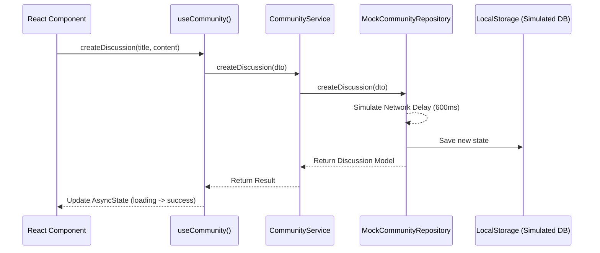

# NOVA Platform Architecture

This document outlines the architectural patterns used in the NOVA Platform, designed to balance frontend-first development speed with backend-ready scalability.

## Architectural Paradigm

The platform utilizes a **Pragmatic Clean Architecture**. This approach decouples the React UI from data fetching and business logic, ensuring high maintainability and a clear path for future backend integration.

### Core Layers

1. **Presentation Layer (React Components & Hooks)**
   * Responsible only for rendering the UI and handling user interactions.
   * Consumes data exclusively via custom hooks (`useCommunity`, `useLaunchpad`).
   * Handles `loading`, `error`, and `success` states seamlessly using the `AsyncState<T>` pattern.

2. **Service Layer (`src/services`)**
   * Contains business logic and orchestration.
   * `CommunityService` and `LaunchpadService` act as the bridge between the UI hooks and the data repositories.
   * The UI never accesses raw data or performs business validation directly.

3. **Repository Layer (`src/repositories`)**
   * Abstracts data access behind strictly typed interfaces (e.g., `ICommunityRepository`).
   * Current implementation: `MockCommunityRepository` simulates network latency and potential failures (for realistic UI testing) while persisting data to `localStorage`.

4. **Domain Layer (`src/domain`)**
   * **Models:** Core TypeScript interfaces representing entities (e.g., `Discussion`, `Event`).
   * **DTOs:** Minimal Data Transfer Objects for state-mutating operations (e.g., `CreateDiscussionDTO`).

---

## Data Flow Example

When a user creates a new discussion:



---

## Future Backend Migration Path

Because the UI and Hooks depend entirely on the Service Layer, and the Service Layer depends entirely on Repository Interfaces, migrating to a real REST API requires **zero changes to the UI code**.

### Migration Steps:

1. **Create REST Repositories:** Create `RestCommunityRepository.ts` implementing `ICommunityRepository` using `fetch` or `axios`.
2. **Update Environment Variable:** Set `VITE_API_BASE_URL` in your `.env` file.
3. **Swap Dependency Injection:** In `src/core/di.ts`, swap the mock repository for the REST repository:

```typescript
// Current:
// export const communityService = new CommunityService(new MockCommunityRepository());

// Future:
import { RestCommunityRepository } from '../repositories/rest/RestCommunityRepository';
export const communityService = new CommunityService(new RestCommunityRepository());
```

By adhering to this pattern, the NOVA platform demonstrates engineering maturity and true scalability while remaining manageable as a student project.
