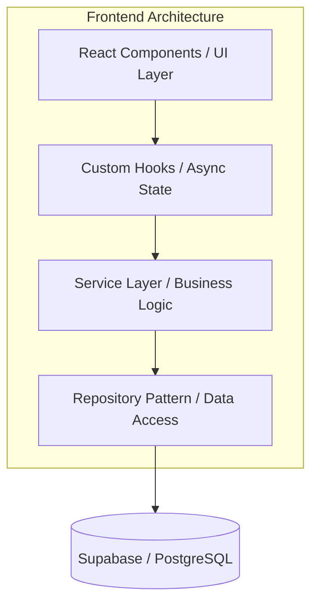
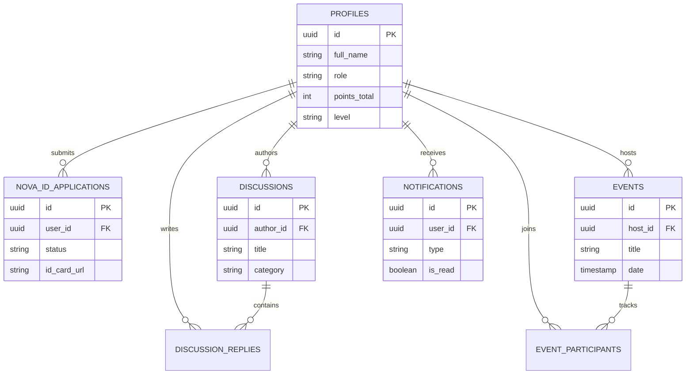

# NOVA Platform
## Why This Project?

### Before
- Static informational website
- Limited student interaction
- No verified identity system
- Fragmented opportunities and discussions

### After
- Career development platform
- Verified student ecosystem
- Community-driven discussions
- Event management and participation
- Realtime engagement and notifications
**A unified digital campus ecosystem for student learning, career development, and community engagement.**

NOVA consolidates fragmented student resources — scattered across chat apps, notice boards, and disconnected websites — into a single, identity-verified platform built on two pillars: **Launchpad** (career growth) and **Community** (peer collaboration).

---

## Table of Contents

- [Features](#features)
- [Technical Architecture](#technical-architecture)
- [Database Schema](#database-schema)
- [Tech Stack](#tech-stack)
- [Engineering Decisions](#engineering-decisions)
- [Setup & Installation](#setup--installation)
- [Demo Flow](#demo-flow)
- [Roadmap](#roadmap)

---

## Features

### Launchpad — Career & Growth

| Feature | Description |
| :--- | :--- |
| **Learning Roadmaps** | Domain-specific, step-by-step progression paths for skill development |
| **Opportunities Board** | Filterable marketplace for hackathons, internships, open-source programs, and workshops with bookmarking |
| **Career Navigator** | Automated guidance system with tailored domain and resource recommendations |
| **Weekly Challenges** | Gamified, community-driven challenges to encourage consistent learning habits |

### Community — Engagement & Collaboration

| Feature | Description |
| :--- | :--- |
| **Discussion Forums** | Threaded, categorized conversations (AI/ML, Placements, Web Dev, etc.) with real-time engagement |
| **Events Platform** | Discover, join, and track Study Circles, Tech Meetups, and Mock Interviews |
| **Member Profiles** | Activity tracking, reputation points, community levels, and achievement badges |
| **Community Dashboard** | Analytics on member activity, trending content, and engagement metrics |
| **Notifications Center** | Centralized hub for discussion updates, event reminders, and community activity |
| **Moderation Dashboard** | Admin controls for content governance, event management, and user verification |

### Identity & Verification

- **NOVA ID System** — Application and verification workflow that validates all members as legitimate students, ensuring accountability in community interactions.
- **Dynamic QR Verification** — Each verified member card generates a secure QR code for instant check-ins and credential verification at physical events and hackathons.

---

## Technical Architecture

The platform follows a strict separation of concerns, decoupling the UI from data fetching and business logic across four layers.



**Layer responsibilities:**

- **UI Layer** — React components handle rendering only; no business logic or data fetching.
- **Custom Hooks** — Manage async state and side effects, exposing clean data interfaces to components.
- **Service Layer** — Encapsulates sorting, filtering, validation, and transformation logic.
- **Repository Layer** — Single point of data access. Abstracts all Supabase calls behind interfaces (`ICommunityRepository`), making the frontend entirely decoupled from the backend implementation.

---

## Database Schema

A normalized relational schema with Row Level Security (RLS) enforced at the database layer.



---

## Tech Stack

| Category | Technology | Purpose |
| :--- | :--- | :--- |
| **Frontend Framework** | React 19 + Vite | Fast rendering with modern concurrent features |
| **Language** | TypeScript | Type safety and self-documenting data models |
| **Backend / BaaS** | Supabase | Managed PostgreSQL, Auth, Realtime, and Storage |
| **Database** | PostgreSQL | Relational data modeling with RLS and triggers |
| **Animations** | Framer Motion | Micro-interactions and route transitions |
| **Styling** | Vanilla CSS (Variables) | Zero-dependency, performant fluid styling |

---

## Engineering Decisions

**Repository Pattern & Dependency Injection**
UI components never call the database directly. All data access goes through repository interfaces, meaning the backend implementation (Supabase) can be swapped for a custom Node.js backend with zero changes to React code.

**Service Layer**
Keeps components lean. Sorting, filtering, and transformation logic lives in the service layer, not inside React components or data repositories.

**Database Triggers (`SECURITY DEFINER`)**
Notification broadcasting runs at the database level via PostgreSQL triggers rather than from the client. When a new event is created, a single trigger fans out notifications to all relevant users automatically — no client-side loops, no extra network calls, and RLS is bypassed safely using `SECURITY DEFINER`.

**Row Level Security (RLS)**
Enforces zero-trust access control at the PostgreSQL kernel level. Users cannot read or manipulate another user's profile, discussion, or data via the API regardless of client-side logic.

**Verified Identity (NOVA ID)**
Anonymous platforms degrade in quality over time. Requiring identity verification creates accountability and raises the standard of academic discourse without burdening the moderation team.

**Why Supabase over a NoSQL store?**
The domain has inherently relational data (profiles → discussions → replies → notifications). Supabase provides PostgreSQL's relational integrity alongside out-of-the-box Auth, RLS, and Storage, which significantly reduces infrastructure complexity for a student-built system.

---

## Setup & Installation

### Prerequisites

- Node.js v18+
- npm or yarn
- Supabase account

### Installation

1. **Clone the repository**
   ```bash
   git clone https://github.com/SreeManas/NOVA-Website-React.git
   cd NOVA-Website-React/NOVA
   ```

2. **Install dependencies**
   ```bash
   npm install
   ```

3. **Configure environment variables**

   Create a `.env` file inside the `NOVA/` directory:
   ```env
   VITE_SUPABASE_URL=your_supabase_project_url
   VITE_SUPABASE_ANON_KEY=your_supabase_anon_key
   ```

4. **Run database migrations**

   Open the Supabase SQL Editor and run the migration files in `NOVA/supabase/migrations/` in sequential order (00 → 07). This creates the schema, RLS policies, and database triggers.

5. **Start development server**
   ```bash
   npm run dev
   ```

6. **Production build**
   ```bash
   npm run build
   ```

---

## Demo Flow

Recommended walkthrough for evaluators:

1. **Launchpad** — Test filtering on the Opportunities Board and explore the Learning Roadmaps.
2. **Career Navigator** — Walk through the personalized guidance flow and review recommendations.
3. **NOVA ID Application** — Interact with a locked Community feature to trigger the ID prompt. Submit an application.
4. **Moderation Dashboard** — Log in as an Admin/Core user and approve the pending application.
5. **QR Verification** — Open the approved NOVA ID and demonstrate the dynamic QR code for event check-in.
6. **Discussions** — Create a new thread in the AI/ML category. Reply to an existing thread to verify nested state updates.
7. **Events** — Join a Tech Meetup and observe the participant counter update optimistically.
8. **Notifications** — Confirm that creating a discussion or event automatically triggered a notification for other users.

---
## Impact

NOVA Platform transforms the existing NOVA website from an informational portal into a complete student ecosystem.

Students can:

- Discover learning resources
- Plan career paths
- Participate in verified communities
- Attend events
- Build reputation
- Collaborate with peers

The platform creates a single destination for learning, networking, and career growth throughout a student's academic journey.
## Roadmap

- **AI-Powered Roadmaps** — LLM-generated, dynamically adapting study paths based on real-time industry trends
- **Mentor Matching** — Connect underclassmen with verified senior students based on overlapping skill domains
- **Live Discussion Chat** — Real-time WebSocket support with typing indicators and presence tracking via Supabase Realtime
- **Platform Analytics** — Aggregate engagement data for community leads to monitor ecosystem health
- **Mobile App** — React Native port with native push notifications and QR scanning